```mermaid
classDiagram
    direction TB

    %% Entidades
    class Produto {
        +Long id
        +String nome
        +BigDecimal preco
        +Integer quantidade
        +Categoria categoria
        +Fornecedor fornecedor
    }

    class Categoria {
        +Long id
        +String nome
    }

    class Fornecedor {
        +Long id
        +String nome
        +String nomeFantasia
        +String cnpj
        +String email
        +String telefone
        +String endereco
    }

    %% Controllers
    class ProdutoController
    class CategoriaController
    class FornecedorController
    class HomeController

    %% Services
    class ProdutoService
    class CategoriaService
    class FornecedorService

    %% Repositórios
    class ProdutoRepository
    class CategoriaRepository
    class FornecedorRepository

    %% Configurações
    class SecurityConfig
    class WebConfig

    %% Relacionamentos de domínio
    Produto --> Categoria : pertence a
    Produto --> Fornecedor : fornecido por

    %% Fluxo de Produto
    ProdutoController --> ProdutoService
    ProdutoService --> ProdutoRepository
    ProdutoRepository --> Produto

    %% Fluxo de Categoria
    CategoriaController --> CategoriaService
    CategoriaService --> CategoriaRepository
    CategoriaRepository --> Categoria

    %% Fluxo de Fornecedor
    FornecedorController --> FornecedorService
    FornecedorService --> FornecedorRepository
    FornecedorRepository --> Fornecedor

    %% Segurança e CORS
    SecurityConfig --> ProdutoController
    WebConfig --> ProdutoController

    %% Home
    HomeController --> ProdutoController : [GET /] health-check
```

# JavaAvanadeProject - Sistema de Controle de Estoque 🛒

[](https://javaavanadeproject-production.up.railway.app)

API REST desenvolvida com **Java + Spring Boot**, utilizando **PostgreSQL** e hospedada na plataforma **Railway**, para controle de produtos, fornecedores e categorias.

Essa aplicação é ideal para empresas que precisam cadastrar, consultar, atualizar e excluir itens do estoque de forma simples, rápida e segura.

---

## 📁 Tecnologias Utilizadas

- Java 17
- Spring Boot 3.4
- Spring Data JPA
- PostgreSQL (Railway)
- Springdoc OpenAPI (Swagger UI)
- Gradle

---

## 🚀 Link da API em produção

**URL base:** [https://javaavanadeproject-production.up.railway.app](https://javaavanadeproject-production.up.railway.app)

**Swagger (Documentação Interativa):**\
[https://javaavanadeproject-production.up.railway.app/swagger-ui.html](https://javaavanadeproject-production.up.railway.app/swagger-ui.html)

---

## 🔄 Estrutura da API

### Entidades

- **Produto**
- **Categoria**
- **Fornecedor**

### Relacionamentos

- Um **Fornecedor** pode ter uma ou mais **Categorias**
- Uma **Categoria** pode ter um ou mais **Produtos**
- Ao deletar um Produto, se for o último da Categoria, a Categoria é excluída.
- Se for a última Categoria do Fornecedor, o Fornecedor também é excluído.

---

## 📌 Ordem correta para inserção de dados

> Para garantir o relacionamento entre entidades, siga a seguinte ordem ao cadastrar:

### 1️⃣ Cadastrar Fornecedor

**Endpoint:** `POST /fornecedores`

```json
{
  "nome": "Distribuidora XPTO",
  "nomeFantasia": "XPTO Comércio",
  "cnpj": "12345678000199",
  "email": "contato@xpto.com.br",
  "telefone": "11999999999",
  "endereco": "Rua das Flores, 123 - São Paulo/SP"
}
```

### 2️⃣ Cadastrar Categoria (vinculada ao Fornecedor criado)

**Endpoint:** `POST /categorias`

```json
{
  "nome": "Limpeza",
  "fornecedor": {
    "id": 1
  }
}
```

### 3️⃣ Cadastrar Produto (vinculado à Categoria criada)

**Endpoint:** `POST /produtos`

```json
{
  "nome": "Detergente 500ml",
  "preco": 3.99,
  "quantidade": 50,
  "categoria": {
    "id": 1
  }
}
```

---

## 🔍 Endpoints principais

### Produto

- `GET /produtos`
- `GET /produtos/{id}`
- `POST /produtos`
- `PUT /produtos/{id}`
- `DELETE /produtos/{id}`

### Categoria

- `GET /categorias`
- `GET /categorias/{id}`
- `POST /categorias`
- `PUT /categorias/{id}`
- `DELETE /categorias/{id}`

### Fornecedor

- `GET /fornecedores`
- `GET /fornecedores/{id}`
- `POST /fornecedores`
- `PUT /fornecedores/{id}`
- `DELETE /fornecedores/{id}`

---

## 🛠️ Como testar a API

### Usando o Swagger:

1. Acesse [https://javaavanadeproject-production.up.railway.app/swagger-ui.html](https://javaavanadeproject-production.up.railway.app/swagger-ui.html)
2. Clique em "Try it out" no endpoint desejado
3. Envie o JSON de exemplo (sem o campo `id` no POST)

### Usando o Postman:

1. Crie uma requisição para `https://javaavanadeproject-production.up.railway.app/fornecedores`
2. Escolha o método POST
3. Use o seguinte corpo como exemplo:

```json
{
  "nome": "Distribuidora XPTO",
  "nomeFantasia": "XPTO Comércio",
  "cnpj": "12345678000199",
  "email": "contato@xpto.com.br",
  "telefone": "11999999999",
  "endereco": "Rua das Flores, 123 - São Paulo/SP"
}
```

---

## 📐 Diagrama de Entidades e Fluxo (Mermaid)



---

## 🌟 Recursos extras

- Validações personalizadas com mensagens amigáveis
- Handler global de exceções (respostas padronizadas com status e mensagem de erro)
- CORS liberado para uso com Swagger
- Deploy contínuo com GitHub + Railway
- Mapeamento JPA com relacionamento entre entidades
- Utilização de `Optional` para evitar `NullPointerException`
- Uso de `ResponseEntity` para controle de respostas HTTP
- Separação em camadas (Controller, Service, Repository)
- Lógica de negócio centralizada nos Services
- Configuração automática de porta para deploy em nuvem (`server.port=${PORT:8080}`)
- Swagger documentando todos os endpoints com suporte a Try It Out
- OpenAPI configurado com servidor externo para produção via HTTPS
- Projeto pronto para entrevistas técnicas e testes práticos de backend

---

## 🚀 Como rodar localmente

```bash
# Clonar o repositório
$ git clone https://github.com/alvaro5801/JavaAvanadeProject.git

# Entrar na pasta
$ cd JavaAvanadeProject

# Rodar com Gradle
$ ./gradlew bootRun
```

Ou rode no VSCode com extensões Java.

---

## 📍 Contato

Feito com carinho por **Álvaro** 💻\
[LinkedIn](https://www.linkedin.com/in/seunomeaqui)

Em caso de dúvidas, sugestões ou melhorias, sinta-se à vontade para abrir um PR ou entrar em contato.

---

**Status:** Projeto funcional ☑️ | Em evolução constante ⚙️

