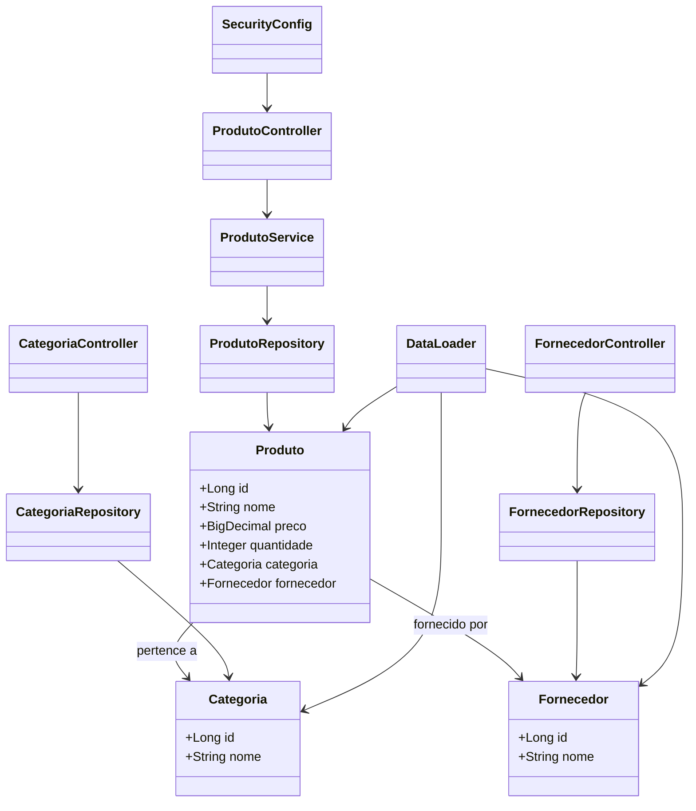

📊 Diagrama de Classes (Mermaid)


```mermaid
classDiagram
    direction TB

    class Produto {
        +Long id
        +String nome
        +BigDecimal preco
        +Integer quantidade
        +Categoria categoria
        +Fornecedor fornecedor
    }

    class Categoria {
        +Long id
        +String nome
    }

    class Fornecedor {
        +Long id
        +String nome
    }

    class ProdutoController
    class CategoriaController
    class FornecedorController
    class ProdutoService
    class ProdutoRepository
    class CategoriaRepository
    class FornecedorRepository
    class SecurityConfig
    class DataLoader

    %% Relacionamentos de domínio
    Produto --> Categoria : pertence a
    Produto --> Fornecedor : fornecido por

    %% Lógica de negócio
    ProdutoController --> ProdutoService
    ProdutoService --> ProdutoRepository
    ProdutoRepository --> Produto

    CategoriaController --> CategoriaRepository
    CategoriaRepository --> Categoria

    FornecedorController --> FornecedorRepository
    FornecedorRepository --> Fornecedor

    %% Configurações
    SecurityConfig --> ProdutoController
    DataLoader --> Categoria
    DataLoader --> Fornecedor
    DataLoader --> Produto


```

# JavaAvanadeProject - Controle de Estoque com Spring Boot

Este é um sistema completo de controle de estoque, desenvolvido com **Spring Boot**, **Java 21** e banco de dados **H2**, com foco em boas práticas de arquitetura, segurança, e extensibilidade. Ideal como projeto técnico para entrevistas e demonstração de conhecimento.

---

## 🧠 Visão Técnica Geral

- **Camadas**: Controller, Service, Repository, Model
- **Padrão**: MVC (Model-View-Controller)
- **Segurança**: Spring Security com autenticação in-memory
- **Persistência**: Spring Data JPA + H2 Database
- **Documentação**: Swagger/OpenAPI 3
- **Validações**: Bean Validation (@Valid, @NotNull, etc.)
- **Tratamento de erros**: ResponseEntity customizados
- **Carga de dados**: via `DataLoader` com `CommandLineRunner`

---

## ⚙️ Tecnologias

| Tecnologia       | Versão/Implementação |
|------------------|----------------------|
| Java             | 21                   |
| Spring Boot      | 3.x                  |
| Spring Web       | REST API             |
| Spring Data JPA  | ORM                  |
| H2 Database      | Em memória           |
| Spring Security  | InMemory Auth        |
| Swagger (Springdoc OpenAPI) | UI REST Docs |
| Gradle           | Build Tool           |

---

## 📁 Estrutura de Pastas

```
src/
 └── main/
     └── java/
         └── lojas.estoque/
             ├── config/              # Configurações de segurança e data loader
             ├── controller/          # Endpoints REST (Produto, Categoria, Fornecedor)
             ├── model/               # Entidades JPA
             ├── repository/          # Interfaces JPARepository
             ├── services/            # Regras de negócio (Produto)
             └── EstoqueApplication   # Classe principal
```

---

## 🔐 Segurança

- Usuário: `admin`
- Senha: `12345`
- Segurança configurada em `SecurityConfig`
- Apenas endpoints de produtos exigem autenticação (`/produtos`)
- Outros estão públicos para facilitar testes

---

## 🔍 Endpoints

Alguns exemplos:

### Produtos
- `GET /produtos` → lista todos os produtos (autenticado)
- `POST /produtos` → cria novo produto
- `PUT /produtos/{id}` → atualiza produto
- `DELETE /produtos/{id}` → remove produto

### Categorias e Fornecedores
- `GET /categorias`, `GET /fornecedores`
- `POST`, `PUT`, `DELETE` disponíveis sem autenticação

---

## 🧪 Testes

- Testes de integração prontos com `@SpringBootTest`
- Testes manuais via Postman
- Verificações de:
  - Status HTTP adequados (200, 201, 409, 404)
  - Mensagens de erro para entidades duplicadas ou inexistentes

---

## 💾 Banco de Dados H2

- URL: `http://localhost:8080/h2-console`
- JDBC URL: `jdbc:h2:mem:estoque`
- Usuário: `admin`
- Senha: `paramore007`

---

## 🚀 Como Executar o Projeto

1. Clone o repositório:
```bash
git clone https://github.com/seu-usuario/JavaAvanadeProject.git
```

2. Acesse o projeto:
```bash
cd JavaAvanadeProject
```

3. Execute com Gradle:
```bash
./gradlew bootRun
```

---

## 📌 Observações Técnicas

- O projeto possui validações para duplicidade (nome de categoria e fornecedor).
- Cada produto pertence a uma categoria e a um fornecedor.
- A lógica de negócio está centralizada no `ProdutoService`.
- O `DataLoader` popula dados iniciais automaticamente na primeira execução.
- O projeto está pronto para ser conectado a banco de dados real em produção (ex: PostgreSQL).

---

## 📄 Autor

Desenvolvido por [Álvaro Silva] – Projeto técnico para fins de entrevista de estágio na Avanade.

