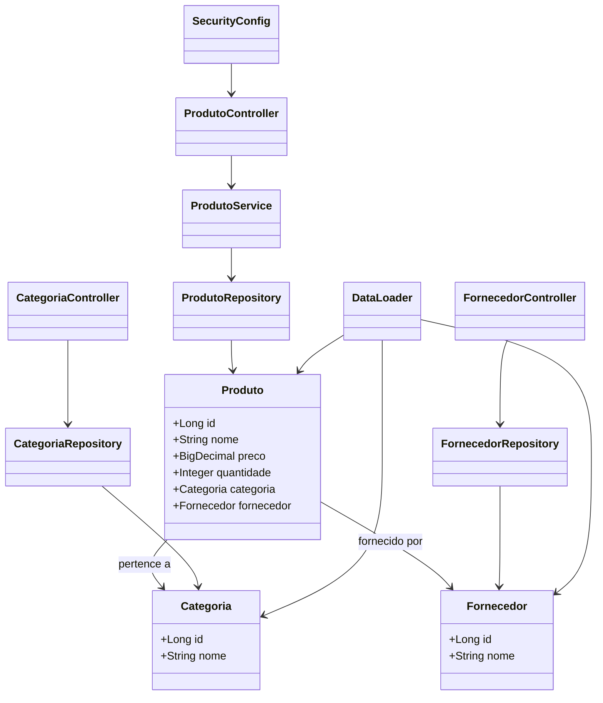

```mermaid
classDiagram
    direction TB

    class Produto {
        +Long id
        +String nome
        +BigDecimal preco
        +Integer quantidade
        +Categoria categoria
        +Fornecedor fornecedor
    }

    class Categoria {
        +Long id
        +String nome
    }

    class Fornecedor {
        +Long id
        +String nome
    }

    class ProdutoController
    class CategoriaController
    class FornecedorController
    class ProdutoService
    class ProdutoRepository
    class CategoriaRepository
    class FornecedorRepository
    class SecurityConfig
    class DataLoader

    %% Relacionamentos de domínio
    Produto --> Categoria : pertence a
    Produto --> Fornecedor : fornecido por

    %% Lógica de negócio
    ProdutoController --> ProdutoService
    ProdutoService --> ProdutoRepository
    ProdutoRepository --> Produto

    CategoriaController --> CategoriaRepository
    CategoriaRepository --> Categoria

    FornecedorController --> FornecedorRepository
    FornecedorRepository --> Fornecedor

    %% Configurações
    SecurityConfig --> ProdutoController
    DataLoader --> Categoria
    DataLoader --> Fornecedor
    DataLoader --> Produto


```
