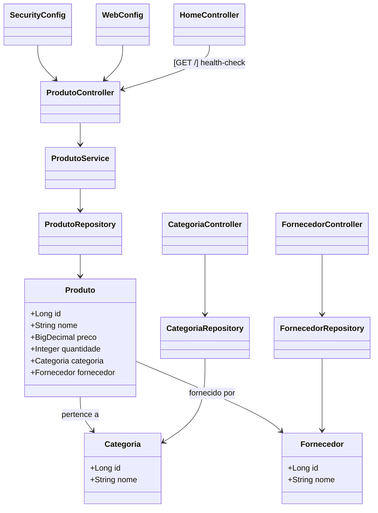

📊 Diagrama de Classes (Mermaid)


```mermaid
classDiagram
    direction TB

    %% Entidades
    class Produto {
        +Long id
        +String nome
        +BigDecimal preco
        +Integer quantidade
        +Categoria categoria
        +Fornecedor fornecedor
    }

    class Categoria {
        +Long id
        +String nome
    }

    class Fornecedor {
        +Long id
        +String nome
    }

    %% Controllers
    class ProdutoController
    class CategoriaController
    class FornecedorController
    class HomeController

    %% Services
    class ProdutoService

    %% Repositórios
    class ProdutoRepository
    class CategoriaRepository
    class FornecedorRepository

    %% Configurações
    class SecurityConfig
    class WebConfig

    %% Relacionamentos de domínio
    Produto --> Categoria : pertence a
    Produto --> Fornecedor : fornecido por

    %% Fluxo de Produto
    ProdutoController --> ProdutoService
    ProdutoService --> ProdutoRepository
    ProdutoRepository --> Produto

    %% Fluxo de Categoria
    CategoriaController --> CategoriaRepository
    CategoriaRepository --> Categoria

    %% Fluxo de Fornecedor
    FornecedorController --> FornecedorRepository
    FornecedorRepository --> Fornecedor

    %% Segurança e CORS
    SecurityConfig --> ProdutoController
    WebConfig --> ProdutoController

    %% Home
    HomeController --> ProdutoController : [GET /] health-check


```

# JavaAvanadeProject - Controle de Estoque com Spring Boot

Este é um sistema completo de controle de estoque, desenvolvido com **Spring Boot**, **Java 17** e banco de dados **PostgreSQL** em nuvem com **Railway**, com foco em boas práticas de arquitetura, segurança e extensibilidade. O projeto foi desenvolvido para fins de **entrevista técnica** e demonstração prática de conhecimento em backend Java.

---

## 🧠 Visão Técnica Geral

- **Camadas**: Controller, Service, Repository, Model
- **Padrão Arquitetural**: MVC (Model-View-Controller)
- **Segurança**: Spring Security com autenticação in-memory
- **Persistência**: Spring Data JPA + Hibernate + PostgreSQL
- **Documentação**: Swagger (Springdoc OpenAPI 3)
- **Validações**: Bean Validation (@Valid, @NotBlank, etc.)
- **Tratamento de erros**: ResponseEntity customizado + GlobalExceptionHandler
- **Deploy**: Railway com build automatizado via Dockerfile e Gradle

---

## ⚙️ Tecnologias

| Tecnologia       | Versão / Implementação     |
|------------------|----------------------------|
| Java             | 21                         |
| Spring Boot      | 3.4.3                      |
| Spring Web       | REST API                   |
| Spring Data JPA  | ORM com Hibernate          |
| PostgreSQL       | Banco de dados em nuvem    |
| Spring Security  | Autenticação básica        |
| Swagger          | OpenAPI + Swagger UI       |
| Gradle           | Build tool                 |
| Railway          | Plataforma de deploy cloud |

---

## 📁 Estrutura de Pastas

```
src/
 └── main/
     └── java/
         └── lojas.estoque/
             ├── config/              # Configurações de segurança e data loader
             ├── controller/          # Endpoints REST (Produto, Categoria, Fornecedor)
             ├── model/               # Entidades JPA
             ├── repository/          # Interfaces JPARepository
             ├── services/            # Regras de negócio (Produto)
             └── EstoqueApplication   # Classe principal
```


## 🔐 Segurança
- Toda a rede e senha estão de acordo com sistema railway onde os mesmo fornecem senha e id automáticos.
- Endpoints `/api/produtos/**` exigem autenticação básica (Basic Auth)
- Endpoints de `/api/categorias` e `/api/fornecedores` são públicos para facilitar testes

---

### Produtos (Requer autenticação)
- `GET /api/produtos` → Listar todos
- `GET /api/produtos/{id}` → Buscar por ID
- `POST /api/produtos` → Criar produto
- `PUT /api/produtos/{id}` → Atualizar
- `DELETE /api/produtos/{id}` → Remover

### Categorias e Fornecedores (Público)
- `GET /api/categorias` | `GET /api/fornecedores`
- `POST /api/categorias` | `POST /api/fornecedores`
- `PUT /api/categorias/{id}` | `PUT /api/fornecedores/{id}`
- `DELETE /api/categorias/{id}` | `DELETE /api/fornecedores/{id}`


---

## 🧪 Testes

- Testes funcionais com Postman
- Validações automáticas:
  - Erros de duplicidade no nome de produtos
  - Respostas com status apropriados (`201`, `400`, `404`)
- Swagger funcionando para testar todos os endpoints via interface

---

## 📦 Banco de Dados (Produção)

- PostgreSQL hospedado na Railway
- Configurações via variáveis de ambiente (`PGHOST`, `PGDATABASE`, etc.)
- **DDL Mode**: `create` (recria as tabelas a cada novo deploy)

## 🚀 Como Executar o Projeto

1. Clone o repositório:
```bash
git clone https://github.com/seu-usuario/JavaAvanadeProject.git
```

2. Acesse o projeto:
```bash
cd JavaAvanadeProject
```

3. Execute com Gradle:
```bash
./gradlew bootRun
```

---

## 📌 Observações Técnicas

- O projeto possui validações para duplicidade (nome de categoria e fornecedor).
- Cada produto pertence a uma categoria e a um fornecedor.
- A lógica de negócio está centralizada no `ProdutoService`.

---

## 👤 Autor

👤 Autor
Desenvolvido por Álvaro Silva
Projeto técnico para processo seletivo de estágio na Avanade
GitHub: alvaro5801

